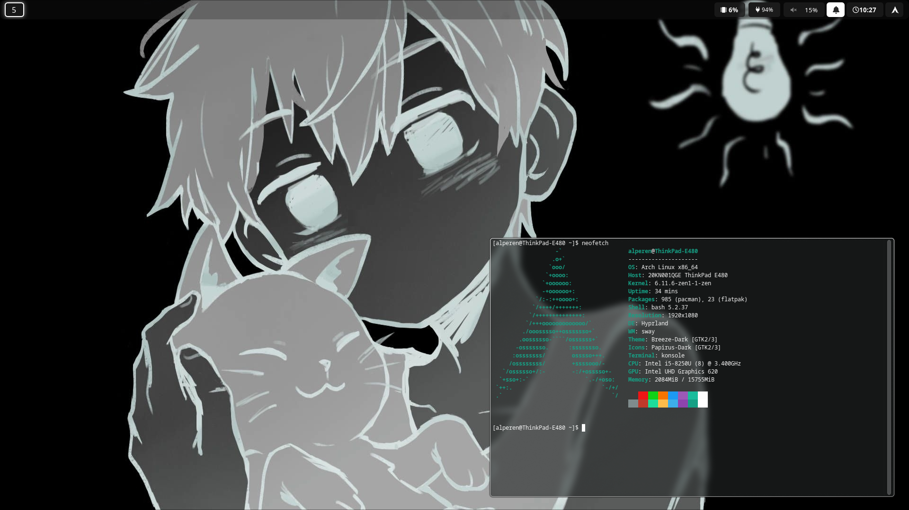

# Dotfiles

This repository contains my personal configuration files (dotfiles) for various applications and tools. The configurations are stored in the `.config` directory for easy management.

## Directory Structure

- `.config/` - Contains configuration files for applications and settings.

## Screenshot

Here's a preview of the setup:

## License

This repository is licensed under the GPL-3.0 License. See the [LICENSE](LICENSE) file for details.
